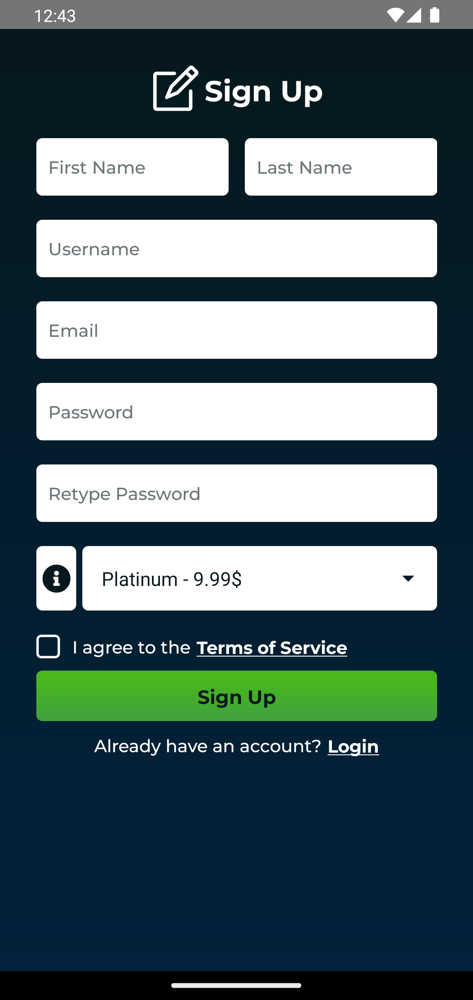
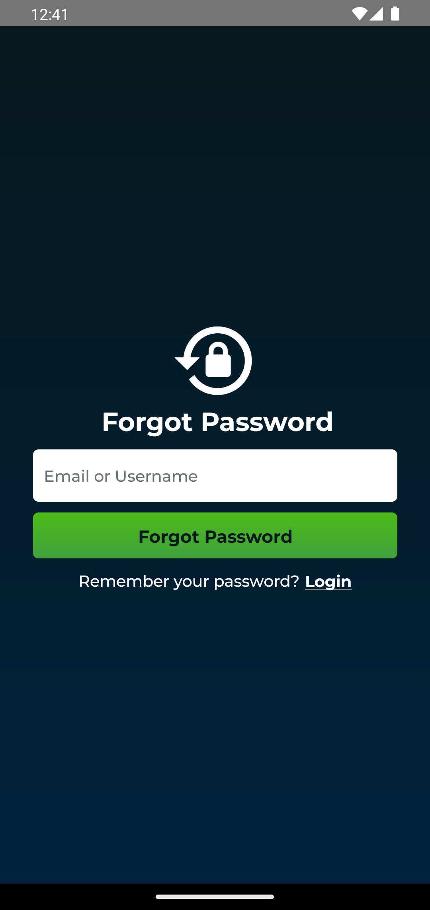
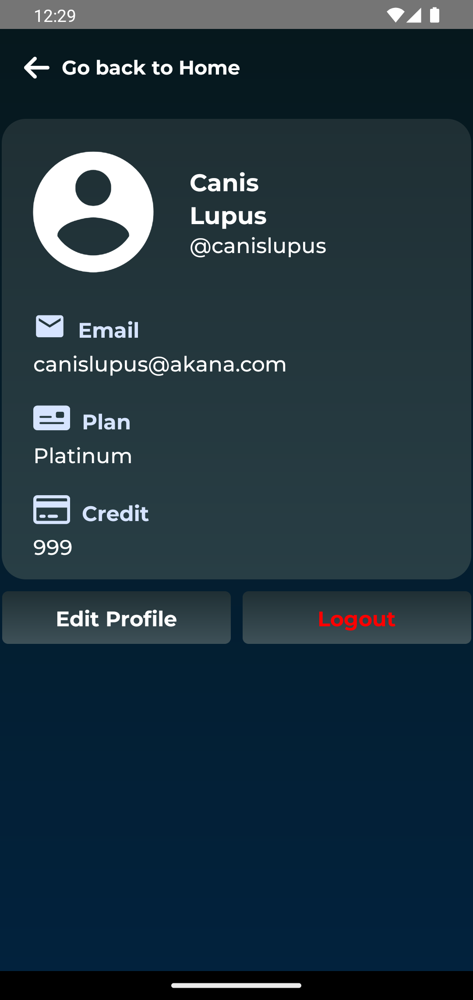
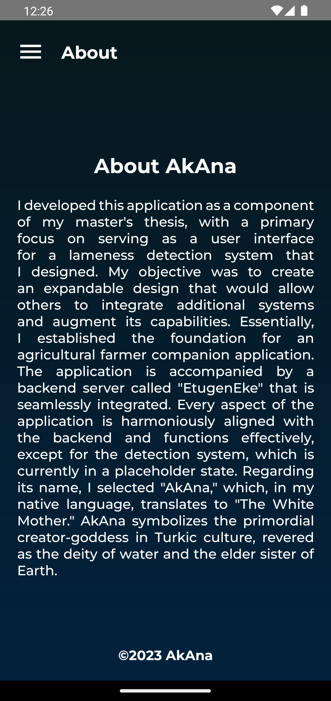

# AkAna
<p align="center">
  
</p>

An App built using React Native for a part of my thesis.

The visuals assets, like the logo and icons, were created using [LeonardoAI](https://leonardo.ai). These were then polished and enhanced with [UpscaleMedia](https://upscale.media) and had their backgrounds removed through [RemoveBg](https://remove.bg). Additionally, the [video](assets/video/splash.mp4) on the splash screen was brought to life using [RunwayAI](https://runway.ml).

The app utilizes Deep Linking, enabling it to navigate to the reset password screen when a valid reset link from the backend, EtugenEke, is accessed.

Also the credentials for the app are saved using [Keychain](https://github.com/oblador/react-native-keychain) encrypted storage.

The application is designed to seamlessly function both offline and in conjunction with the backend through a fully integrated caching system.

The code base is modularized and each component is designed to be reusable and expandable. Also, all of the components have the necesary comments and documentation to make them easy to understand and use.

The App contains the following screens:
<div align="center">
  
  
  
  
</div>
<div align="center">
  
  
  
  
</div>
<div align="center">
  
  
</div>
<div align="center">
  
</div>

## Usage
1. Clone the repository
   ```
    git clone https://github.com/AliKHaliliT/AkAna
   ```
2. Run `npm install` to install the dependencies
3. Run `npx react-native run-android` to run the app on your device

Note that if you want to use the backend, you need to change the address prefix located at `assets/api/tempServerAddress.js` to your designated ip address and port. For example, when running the backend on your local machine, you can set the prefix to `http://yourIpAddress:yourPort`.

In order to browse the app without the backend to get pass the login, you can use the following credentials:
```
username: canislupus
password: canislupus
``````

## About
I developed this application as a component of my master's thesis, with a primary focus on serving as a user interface for a lameness detection system that I designed. My objective was to create an expandable design that would allow others to integrate additional systems and augment its capabilities. Essentially, I established the foundation for an agricultural farmer companion application. The application is accompanied by a backend server called "EtugenEke" that is seamlessly integrated. Every aspect of the application is harmoniously aligned with the backend and functions effectively, except for the detection system, which is currently in a placeholder state. Regarding its name, I selected "AkAna," which, in my native language, translates to "The White Mother." AkAna symbolizes the primordial creator-goddess in Turkic culture, revered as the deity of water and the elder sister of Earth.

## Backend 
The backend lives in the sister repository [EtugenEke](https://github.com/AliKHaliliT/EtugenEke).

## License
This work is under an [MIT](https://choosealicense.com/licenses/mit/) License.
